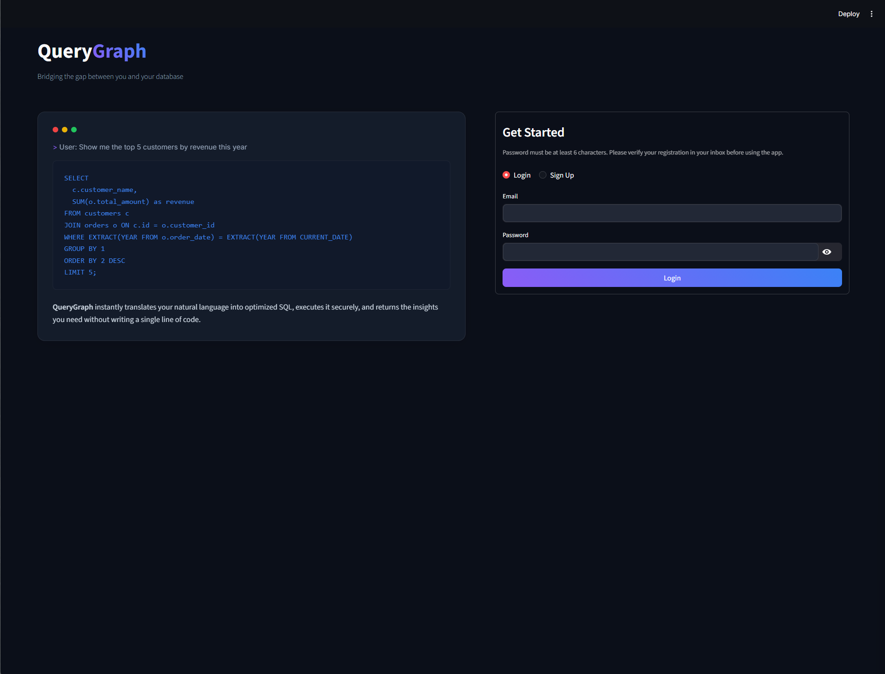
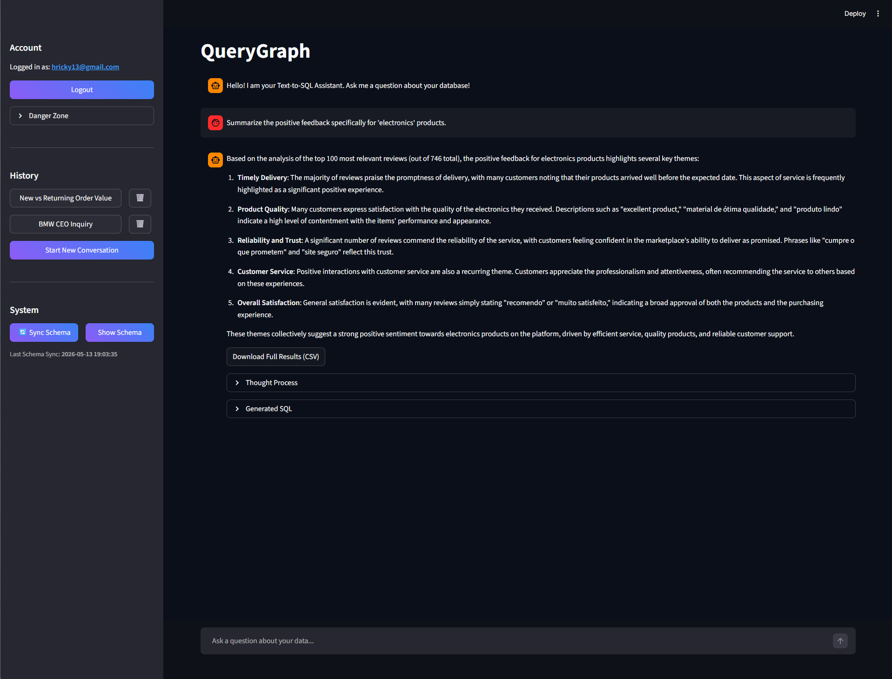
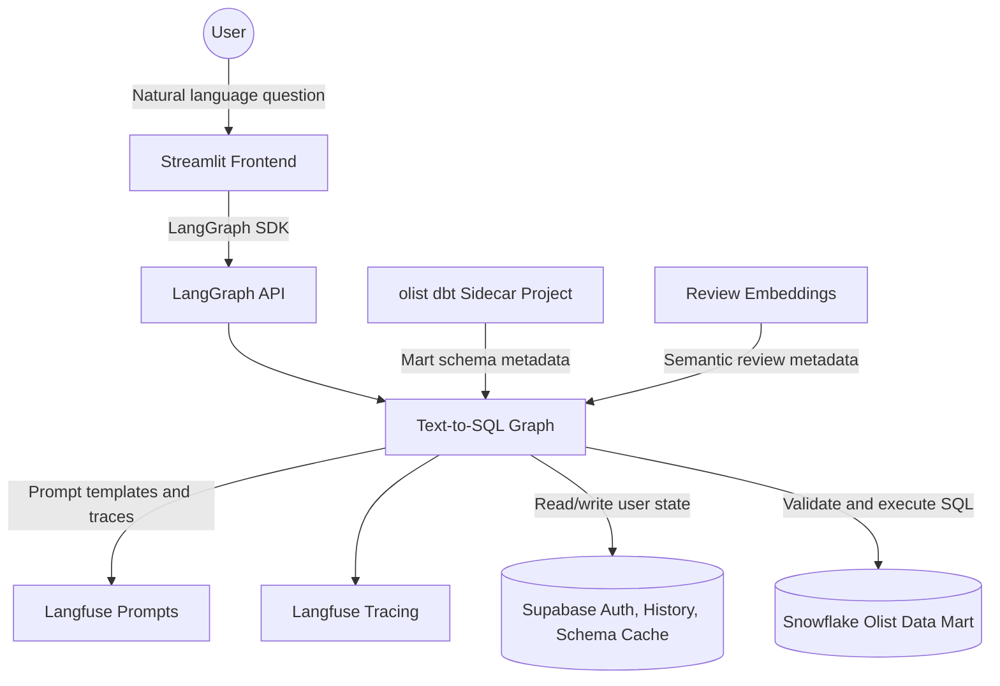
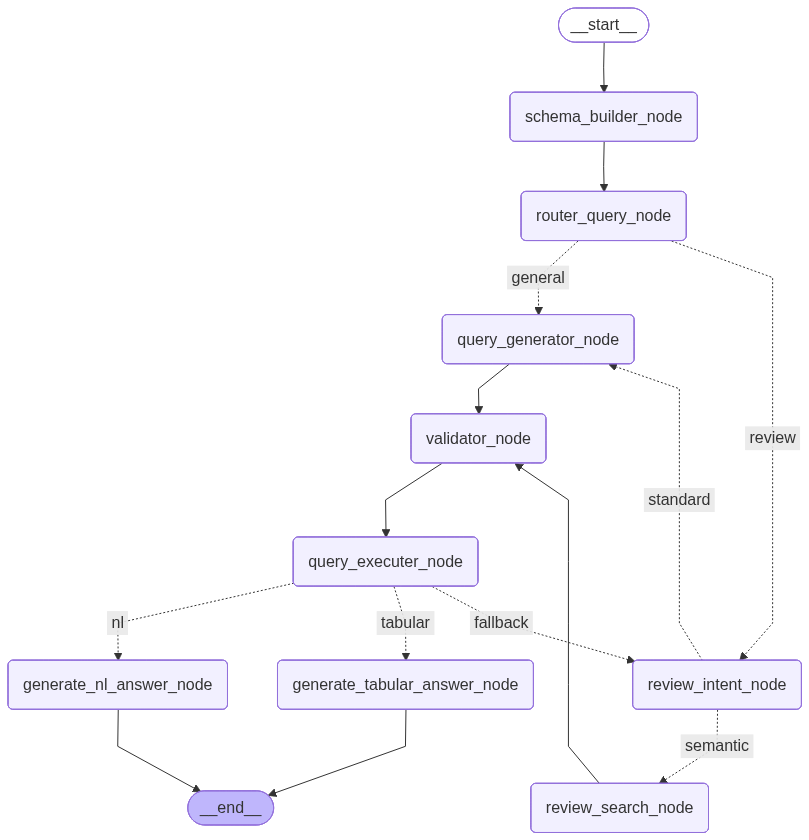
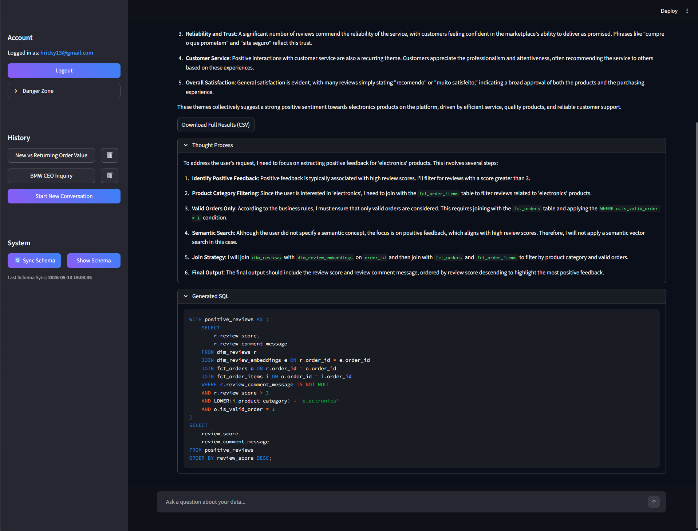
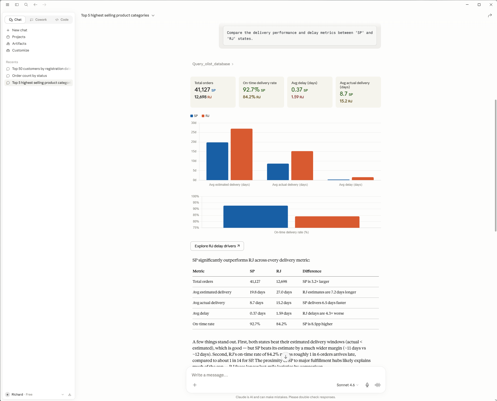

# QueryGraph: Production-Grade Text-to-SQL Assistant for Snowflake

[](https://www.python.org/downloads/)
[](https://streamlit.io/)
[](https://www.langchain.com/langgraph)
[](https://www.snowflake.com/)
[](https://supabase.com/)
[](https://langfuse.com/)
[](https://www.docker.com/)
[](.github/workflows/ci.yaml)

QueryGraph is a conversational analytics application that lets users ask business questions in natural language and receive trusted answers from a Snowflake data mart. It is built around the Olist e-commerce dataset and is designed for users who need analytical answers without knowing SQL, table relationships, database schemas, or warehouse-specific syntax.

The application combines a Streamlit chat UI, a LangGraph text-to-SQL workflow, Snowflake execution, Supabase authentication and chat persistence, Langfuse tracing, and guardrails for safer LLM/database interaction.



---

## Use Case

QueryGraph solves the "I need the data, but I do not know the SQL" problem.

A user can ask questions such as:

- Which product categories have the highest average review scores?
- Compare delivery performance between Brazilian states.
- Summarize positive feedback for electronics products.
- Show the result as a table and let me download it.
- Explain the answer in natural language instead of returning raw rows.

QueryGraph translates the question into schema-aware SQL, validates the query with Snowflake, executes it, and returns either a natural language answer or a tabular result. For review-related questions, it can also use semantic search over embedded review concepts.



---

## System Architecture & Lifecycle

The project is organized as a production-style text-to-SQL system with a clear split between the UI, graph orchestration, data warehouse, persistence layer, and observability.



The runtime graph is generated from `src/graph_builder/graph_builder.py` and exposed through `src/graph.py`.



---

## Agent Workflow

The LangGraph workflow handles the full lifecycle of a user question:

1. Load or rebuild unified schema metadata from dbt mart YAML and embedding metadata.
2. Sanitize the user question and chat history with guardrails.
3. Detect whether the message is general conversation or a database question.
4. Route analytical questions to standard SQL generation or semantic review search.
5. Generate Snowflake SQL using the available schema context.
6. Deanonymize safe placeholders required for execution.
7. Validate SQL with Snowflake `EXPLAIN`.
8. Execute the validated SQL against Snowflake.
9. Sanitize result rows before LLM summarization.
10. Return tabular data, a natural language answer, or a review sentiment summary.
11. Persist the conversation in Supabase.



---

## The Tech Stack

| Category | Tools Used |
| :--- | :--- |
| Core Language | Python 3.12 |
| Agent Workflow | LangGraph, LangGraph SDK, LangChain |
| Frontend UI | Streamlit, pandas CSV export |
| Data Warehouse | Snowflake, `snowflake-connector-python`, `snowflake-sqlalchemy` |
| Authentication & Persistence | Supabase, PostgreSQL, `psycopg`, `psycopg2-binary`, `langgraph-checkpoint-postgres` |
| LLM Providers | LangChain chat model abstraction, OpenAI, optional Groq |
| Embeddings | `langchain-openai`, OpenAI embeddings |
| Observability | Langfuse prompt management and tracing |
| Guardrails | `llm-guard`, Transformers, Optimum, ONNX Runtime |
| Data Modeling | dbt with `dbt-snowflake` |
| Testing & Evaluation | pytest, DeepEval |
| Code Quality | Ruff, SQLFluff with dbt templating |
| Runtime | Docker, Docker Compose, Redis |
| MCP Integration | MCP, FastMCP, Uvicorn |
| Dependency Management | uv |
| CI/CD | GitHub Actions with Ruff, SQLFluff, and prompt sync |

---

## Prompt Management

QueryGraph fetches prompts from Langfuse by default. This keeps production prompt versions centralized and traceable while the local repository still keeps YAML prompt definitions in `src/prompts/`.

Local prompt files can be synchronized with Langfuse using `sync_prompts.py`:

```bash
# Push local YAML prompts to Langfuse
uv run python sync_prompts.py --push

# Pull production prompts from Langfuse into src/prompts/
uv run python sync_prompts.py --pull
```

The GitHub Actions CI pipeline also runs prompt synchronization on pushes to `main`, so production prompt updates can be promoted from the repository automatically.

---

## Product Experience

The Streamlit interface supports:

- User signup and login with Supabase Auth.
- Conversation history scoped to the logged-in user.
- New conversation creation and thread deletion.
- Schema sync and schema viewer controls.
- Generated SQL and thought process expanders.
- Tabular result rendering.
- CSV download when full results exceed the UI preview.
- Account deletion flow.

The project also includes an MCP server option so the assistant can be exposed through a Model Context Protocol interface.



---

## Sidecar dbt Project

The `olist/` folder is a separate sidecar dbt project. It was used to set up the Snowflake data mart that this application queries.

You do not need to work inside `olist/` to run or understand the main QueryGraph application. The important connection is that QueryGraph reads mart metadata from files such as `olist/models/marts/_marts_schema.yml` when building its schema context.

---

## Setting Up

### 1. Create Environment File

Create a local `.env` from the provided template:

```bash
cp .env.example .env
```

Then fill in Snowflake, Supabase, Langfuse, and model provider credentials.

### 2. Sync Python Environment

```bash
uv sync
```

### 3. Create Supabase Tables

```bash
uv run python setup_db.py --action create
```

Other available setup actions:

```bash
uv run python setup_db.py --action drop
uv run python setup_db.py --action reset
```

### 4. Prepare Snowflake Data

If you need to load the raw Olist CSV files into Snowflake:

```bash
uv run python run_ingestion.py
```

This pipeline creates raw Snowflake tables, uploads CSV files from `data/raw/` to a Snowflake stage, and loads the raw data. The analytical data mart itself is based on the sidecar dbt project in `olist/`.

---

## Running the Application

### Local Development

Start the LangGraph API:

```bash
uv run langgraph dev
```

Start the Streamlit frontend in a second terminal:

```bash
uv run streamlit run src/ui/app.py
```

Open the Streamlit URL shown in the terminal, typically:

```text
http://localhost:8501
```

For local development, keep:

```env
LANGGRAPH_URL=http://localhost:2024
```

### Docker Compose

Run the LangGraph API, Redis, and Streamlit frontend together:

```bash
docker compose up --build
```

Default service URLs:

| Service | URL |
| :--- | :--- |
| Streamlit frontend | `http://localhost:8501` |
| LangGraph API | `http://localhost:8123` |
| Redis | `localhost:6379` |

Inside Docker, the frontend uses `LANGGRAPH_URL=http://langgraph-api:8000`.

### MCP Server

Run the LangGraph API, Redis, and MCP server:

```bash
docker compose -f docker-compose.mcp.yml up --build
```

Default MCP service URL:

```text
http://localhost:8080
```

To stop the MCP stack:

```bash
docker compose -f docker-compose.mcp.yml down
```

---

## Claude Desktop MCP Setup

QueryGraph can be connected to Claude Desktop through the local MCP server. Once configured, Claude can query the Olist data mart through the same LangGraph text-to-SQL workflow and export large results as CSV files.

### Prerequisites

Install these on the host machine:

- Docker Desktop with WSL2 backend enabled on Windows.
- Node.js, including `npx`.
- Claude Desktop.

### 1. Configure MCP Credentials

Add MCP credentials to your `.env` file:

```env
MCP_USER_EMAIL=your_email@example.com
MCP_USER_PASSWORD=your_secure_password
HOST_PROJECT_PATH=D:/Projects/Text-to-SQL_project
```

The MCP server performs a zero-touch authentication flow. If the email does not exist in Supabase yet, the server can register it on the first query. If it already exists, the server logs in silently and uses that user context for graph execution and Langfuse tracing.

`HOST_PROJECT_PATH` is used when the MCP server returns local CSV download links for large result sets.

### 2. Start the MCP Docker Stack

```bash
docker compose -f docker-compose.mcp.yml up --build -d
```

This starts:

- Redis.
- The LangGraph API executor.
- The FastMCP server exposed on port `8080`.

### 3. Configure Claude Desktop

Open Claude Desktop settings and edit the local `claude_desktop_config.json` file. Add the `text-to-sql` server under `mcpServers`:

```json
{
  "mcpServers": {
    "text-to-sql": {
      "command": "npx",
      "args": [
        "-y",
        "mcp-remote",
        "http://127.0.0.1:8080/sse",
        "--allow-http"
      ]
    }
  }
}
```

Save the file, then completely restart Claude Desktop. On Windows, make sure it is also closed from the system tray before relaunching.

### 4. Verify the Connector

Start a new Claude chat, open the connector/tools menu, and check that `text-to-sql` is listed as an active connector.

Example prompts:

- Show me a list of the top 5 product categories by revenue.
- How many orders were delivered in state SP in 2018?

### CSV Exports

The MCP server avoids flooding Claude with large result sets. If a query returns more than the configured display thresholds, it writes the full result to the mounted local `downloads/` folder and returns a local file link.

Current thresholds:

- Tabular answers: more than 10 rows.
- Natural language answers: more than 5 rows.

---

## Testing and Evaluation

Run the test suite:

```bash
uv run pytest
```

The correctness suite in `tests/correctness/` uses DeepEval scenarios to compare graph outputs against expected answers. These tests require a configured `.env`, reachable Snowflake and Supabase services, valid Langfuse credentials, and an existing schema cache.

If the schema cache does not exist yet, run the app once or use the UI's schema sync button.

To run the correctness suite through DeepEval directly:

```bash
uv run deepeval test run tests/correctness/test_correctness.py
```

If you want DeepEval run artifacts written to a local folder, set `DEEPEVAL_RESULTS_FOLDER` before running the tests:

```bash
export DEEPEVAL_RESULTS_FOLDER="./deepeval_test_results"
uv run deepeval test run tests/correctness/test_correctness.py
```

PowerShell equivalent:

```powershell
$env:DEEPEVAL_RESULTS_FOLDER="./deepeval_test_results"
uv run deepeval test run tests/correctness/test_correctness.py
```

---

## CI Pipeline

The repository includes a GitHub Actions workflow at `.github/workflows/ci.yaml`. It runs on pushes and pull requests targeting `main`.

The pipeline performs:

- Dependency installation with `uv`.
- Ruff lint checks.
- Ruff formatting checks.
- SQLFluff linting with the Snowflake dialect.
- Prompt synchronization to Langfuse on pushes to `main`.

The workflow expects project secrets for Snowflake, Supabase, Langfuse, and model configuration.

---

## Development Commands

| Command | Purpose |
| :--- | :--- |
| `uv sync` | Install dependencies from `pyproject.toml` and `uv.lock`. |
| `uv run langgraph dev` | Start the local LangGraph development API. |
| `uv run streamlit run src/ui/app.py` | Start the Streamlit frontend. |
| `uv run pytest` | Run tests. |
| `uv run deepeval test run tests/correctness/test_correctness.py` | Run DeepEval correctness tests directly. |
| `uv run ruff check .` | Run Python linting. |
| `uv run python setup_db.py --action create` | Create Supabase app tables. |
| `uv run python run_ingestion.py` | Load raw Olist CSV data into Snowflake. |
| `uv run python sync_prompts.py --push` | Push local YAML prompts to Langfuse. |
| `uv run python sync_prompts.py --pull` | Pull production Langfuse prompts into local YAML files. |
| `docker compose up --build` | Run the API and frontend stack in Docker. |
| `docker compose -f docker-compose.mcp.yml up --build` | Run the API and MCP stack in Docker. |

---

## Project Structure

```text
.
|-- .github/workflows/      # GitHub Actions CI pipeline
|-- src/                    # Core application package
|   |-- config/             # Environment configuration and service clients
|   |-- database/           # Supabase auth, history, schema cache, and setup helpers
|   |-- graph_builder/      # LangGraph workflow definition
|   |-- guardrails/         # Input, output, and result safety handling
|   |-- mcp/                # MCP server entry point
|   |-- nodes/              # LangGraph node implementations
|   |-- prompts/            # YAML prompt templates
|   |-- states/             # Pydantic state and response models
|   |-- ui/                 # Streamlit app, CSS, and HTML components
|   `-- utils/              # Shared database, LLM, YAML, and UI utilities
|-- ingestion/              # Raw CSV to Snowflake ingestion pipeline
|-- embeddings/             # Review embedding creation and embedding schema metadata
|-- tests/correctness/      # DeepEval correctness scenarios and dataset
|-- snowflake_scripts/      # Snowflake setup and cleanup SQL
|-- docker/                 # Dockerfiles for API, Streamlit, and MCP services
|-- data/raw/               # Raw Olist CSV files
|-- pictures/               # README screenshots and UI examples
|-- graph_image/            # Generated LangGraph workflow image
|-- olist/                  # Sidecar dbt project for the Snowflake data mart
|-- docker-compose.yml      # API + Streamlit runtime
|-- docker-compose.mcp.yml  # API + MCP runtime
|-- langgraph.json          # LangGraph API configuration
|-- setup_db.py             # Supabase table setup utility
|-- run_ingestion.py        # Snowflake raw ingestion pipeline
|-- .env.example            # Environment variable template
`-- pyproject.toml          # Project dependencies and tooling config
```

---

## Notes and Limitations

- QueryGraph is tailored to the Olist e-commerce data model.
- The app expects the Snowflake data mart and dbt metadata to match the project schema.
- Selected sensitive columns are filtered before schema context is shown to the LLM.
- Query results are capped before downstream summarization.
- Semantic review search depends on review embeddings being created and queryable.
- Supabase service-role credentials are required for setup and administrative actions.
- Langfuse is part of the runtime path because prompts and tracing are integrated into the graph.

---

## License

See `LICENSE`.
